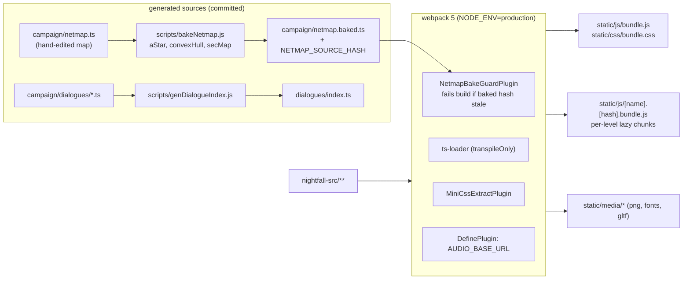
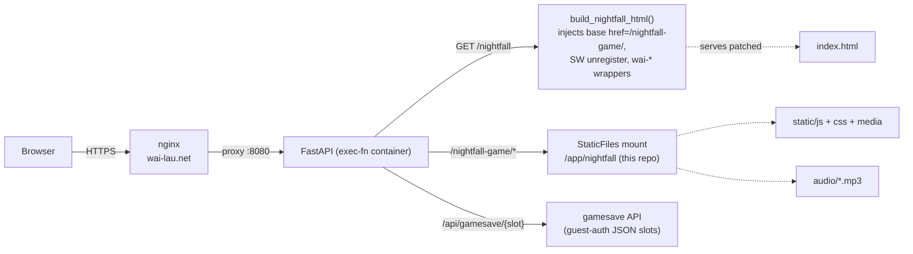
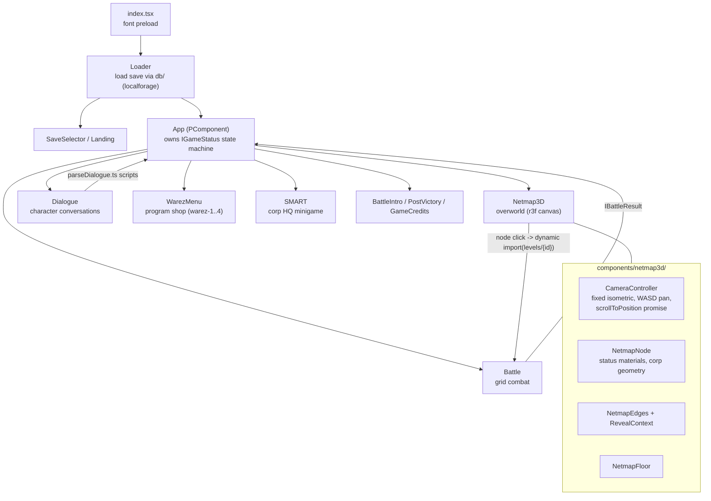
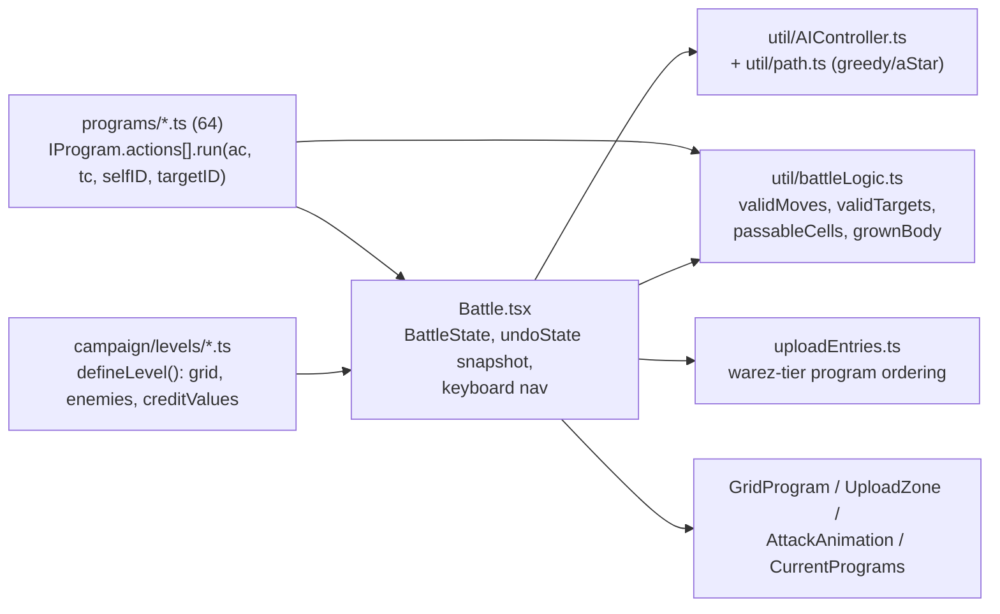

# Nightfall — Architecture

Grid-based hacking tactics RPG in the browser. Single-page React app, no
backend of its own — it rides inside the exec-fn FastAPI container, which
serves the static bundle and provides a tiny save-sync API.

---

## Tech stack

| Layer | Tech | Notes |
|-------|------|-------|
| UI | React 17 (`react-dom`) | Class components throughout; `PComponent` base adds promisified `setState` (`setStateP`) |
| Language | TypeScript 4.9 | `ts-loader` with `transpileOnly: true` (type-checking happens in editor/CI, not in the build) |
| 3D | three.js 0.184 + `@react-three/fiber` 7 + `@react-three/drei` 8 | Only for the Netmap3D overworld; battles are DOM/CSS |
| Persistence | `localforage` (IndexedDB) | Save slots; mirrored server-side via `wai-save-sync.js` |
| Bundler | webpack 5 | Custom config, no CRA. `MiniCssExtractPlugin`, `DefinePlugin`, custom `NetmapBakeGuardPlugin` |
| Tests | vitest | `util/battleLogic.test.ts` |
| Lint | ESLint 9 (`typescript-eslint`, react, react-hooks) + stylelint 16 | Configs in `nightfall-src/` |
| Utilities | `classnames`, `clone`, `csstype` | `clone` does the deep state snapshots (move undo) |

Legacy remnants: `serviceWorker.js` is the old CRA service worker, explicitly
`unregister()`-ed at boot; root-level `precache-manifest.*.js` /
`asset-manifest.json` are fossil CRA build output.

---

## Repo layout

```
nightfall/
  nightfall-src/          # all source
    index.tsx             # entry: font preload -> <Loader/>
    components/           # React components (+ per-component CSS)
      netmap3d/           # CameraController, NetmapNode, NetmapEdges, NetmapFloor, RevealContext
    campaign/             # game data: netmap.ts (+ netmap.baked.ts), characters,
                          #   levels/ (53), dialogues/ (58), audio configs, node styles
    programs/             # 64 program definitions (IProgram)
    types/                # shared interfaces (IProgram, IGameStatus, Coordinate, ...)
    util/                 # battleLogic, AIController, path, AudioContext/Shuffler, parseDialogue
    db/                   # localforage instance + gameStatus load/save
    scripts/              # bakeNetmap.js, genDialogueIndex.js
    webpack.config.js
  static/                 # compiled output (gitignored js/css) — building IS deploying
  audio/                  # mp3s served directly
  index.html              # boot progress bar (window.__nfProgress), loads bundle
  wai-head.js             # AudioContext autoplay-unlock patch
  wai-body.html           # fullscreen wrapper (#wai-fs-btn, portrait rotation)
  wai-save-sync.js        # IndexedDB <-> /api/gamesave sync
```

---

## Build and deploy

The repo is volume-mounted into the exec-fn container; FastAPI serves
`static/` straight off disk, so a production webpack build is the deploy.
`NODE_ENV=production` is mandatory — it switches `publicPath` and
`AUDIO_BASE_URL` to the `/nightfall-game/` mount; without it assets 404
(silent black screen).



Two invariants the build enforces:

- **Bake guard** — `netmap.baked.ts` embeds a sha256 of `netmap.ts`;
  webpack refuses to compile if they diverge. Re-bake with
  `npm run bake-netmap`.
- **Chunk hashing** — the entry `bundle.js` keeps a stable name (the server
  cache-busts it with `?v=`), but lazy per-level chunks get a
  `[contenthash:8]` so a changed chunk can never serve stale.

---

## Serving topology



The page route is `/nightfall`; all assets resolve through the injected
`<base href="/nightfall-game/">` against the static mount. The wrapper files
(`wai-head.js`, `wai-body.html`, `wai-save-sync.js`) are exec-fn-side
augmentations injected at serve time — game source never references them.

---

## Runtime component architecture

Boot: `index.html` paints a progress bar (`window.__nfProgress`),
`index.tsx` preloads the three bitmap fonts, then mounts `Loader`.



`App` is the single source of truth for game progression (`IGameStatus`:
node statuses, credits, owned programs). Levels are loaded with
`await import("../campaign/levels/" + id)` — each level becomes its own
webpack chunk, fetched on first entry. Only `Netmap3D.tsx` is live; the old
2D `Netmap.tsx` is dead code kept for reference.

---

## Battle engine



Key conventions (see CLAUDE.md for the full list):

- Program actions return arrays of effect promises (`ac.*`), all awaited;
  `targetID` is null on empty cells — effects gate on it.
- Move undo is a full-state snapshot taken before each move, cleared on
  action commit or turn end — never undoable past an attack.
- `buildUploadEntries` is the single source of truth for shop/upload
  ordering (grouped by program line, sorted by warez tier).

---

## Audio

Web Audio API behind `util/AudioContext.ts` (`IAudioContext`), with
`AudioShuffler` cycling per-corp track configs
(`campaign/corpAudioConfigs.ts`, `databattleAudioShuffleConfig.ts`).
Files fetched from `AUDIO_BASE_URL` (webpack DefinePlugin:
`/nightfall-game/audio` in prod, `/audio` in dev). Two autoplay-policy
patches wrap the constructor and resume suspended contexts on
`visibilitychange` (`index.html` and `wai-head.js`/`wai-body.html` — the
wrapper variant tracks `window._waiAudioContexts`).

---

## Saves

Local-first: `db/` wraps a `localforage` IndexedDB instance
(`nightfall/nightfall-save`); `db/gameStatus.ts` serializes `IGameStatus`
per slot. The exec-fn wrapper syncs slots to the server so saves roam
across devices:

```mermaid
sequenceDiagram
    participant Game as Game (localforage)
    participant Sync as wai-save-sync.js
    participant API as FastAPI /api/gamesave

    Note over Sync: page load
    Sync->>API: GET /api/gamesave (all slots)
    API-->>Sync: { save1: ..., ... }
    Sync->>Game: dbSet(slot) for missing/newer server slots
    Note over Game: play; saves write to IndexedDB
    Game-->>Sync: (IndexedDB writes observed)
    Sync->>API: POST /api/gamesave/{slot}
    Note over API: JSON blobs on the exec-fn data volume
```

Server slots live behind guest auth; the game itself never talks to the
API — only the injected sync script does.

---

## Tooling

| Command (in `nightfall-src/`) | What |
|---|---|
| `NODE_ENV=production npm run build` | webpack → `../static/` (this is the deploy, ~45s) |
| `npm start` | webpack-dev-server on :3000 |
| `npm run bake-netmap` | regenerate `netmap.baked.ts` (required after editing `netmap.ts`) |
| `npm run gen-dialogues` | regenerate `dialogues/index.ts` |
| `npm test` | vitest (battle logic) |

Git hooks: pre-commit lints staged `.ts/.tsx` (ESLint) and `.css`
(stylelint) — errors block, warnings pass; install via
`bash scripts/install-hooks.sh`. Post-commit/post-checkout rebuild the
graphify knowledge graph (`graphify hook install`).

`bin/recolor_icons.py` recolors program icon PNGs — recoloring a program
means updating both its `.ts` `color` and its icon (see CLAUDE.md).
